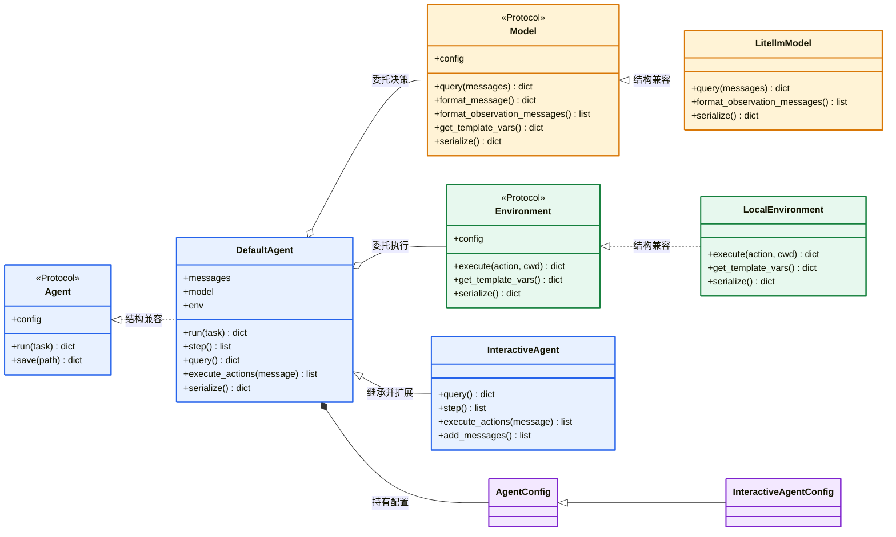

# mini-SWE-agent 核心主体与协作边界

## 架构结论

这个项目不是把三个平级“能力插件”随意拼在一起，而是形成了明确的包含和委托关系：

```text
Agent = 控制器与状态持有者
Model = 决策策略与模型协议适配器
Environment = 执行策略与运行环境适配器
```

Agent 持有 Model 和 Environment，并在主循环中调用它们。Model 与 Environment 互不直接依赖，它们通过 Agent 以及约定好的消息、动作、输出结构协作。

主体关系与关键方法见：`<图：核心主体、接口与实现关系>`。

## 根包先定义共同语言

[`minisweagent/__init__.py`](../../../src/minisweagent/__init__.py) 不只是一个空的包初始化文件。它把系统最核心的三个抽象放在根包：

```python
class Model(Protocol): ...
class Environment(Protocol): ...
class Agent(Protocol): ...
```

这样做的意义不是集中创建对象，而是让各子包共享同一套最小契约：

- `agents` 只依赖 `Model`、`Environment` 的协议，不依赖某个具体模型或环境；
- `run` 可以把任意满足协议的具体对象装配起来；
- 工厂函数可以用 `Agent`、`Model`、`Environment` 表达返回值角色；
- 新实现只需保持方法形状兼容，不必修改控制器主链路。

Python 的 `Protocol` 更接近“结构化接口”。例如 `LitellmModel` 没有写：

```python
class LitellmModel(Model):
```

但只要它提供协议要求的方法，静态类型检查器就可以把它看作 `Model`。这不同于 Java 必须显式 `implements Model` 的名义类型关系。

需要特别注意：`Protocol` 主要帮助静态检查和阅读，它不会自动替实现类注入代码，也不会在每次构造时做完整运行时校验。

## Agent：主循环的拥有者

[`DefaultAgent`](../../../src/minisweagent/agents/default.py) 是最小可工作的控制器。它通过构造器接收：

```python
def __init__(self, model: Model, env: Environment, ...):
    self.model = model
    self.env = env
```

### 自己高内聚的职责

Agent 自己负责所有“控制一次任务怎样活下去”的逻辑：

| 方法或状态 | 对主链路的贡献 |
|---|---|
| `run()` | 初始化消息、反复执行 step、处理控制异常、判断退出 |
| `step()` | 把一次决策和一次执行串成最小循环单元 |
| `messages` | 保存跨轮次上下文 |
| `query()` | 检查限制、调用 Model、累计次数和成本 |
| `execute_actions()` | 把 Model 产生的动作交给 Environment |
| `add_messages()` | 统一维护消息历史 |
| `get_template_vars()` | 汇总 Agent、Model、Environment 的模板变量 |
| `serialize()` / `save()` | 汇总三个组件的状态并保存 trajectory |

这里的 `query()` 名字容易让人误以为 Agent 自己实现了模型请求。实际上它做的是控制层工作，然后委托：

```python
message = self.model.query(self.messages)
```

同理，`execute_actions()` 不亲自启动进程，而是委托：

```python
self.env.execute(action)
```

### InteractiveAgent 增加什么

[`InteractiveAgent`](../../../src/minisweagent/agents/interactive.py) 继承 `DefaultAgent`，复用主循环，并覆盖若干扩展点：

- `add_messages()`：把消息打印到终端；
- `query()`：支持 human 模式和超限后的人工处理；
- `step()`：处理中断键；
- `execute_actions()`：执行前确认命令；
- `_check_for_new_task_or_submit()`：退出前询问用户。

这是一种模板方法式扩展：基础类固定主流程，子类覆盖流程中的局部步骤。它并没有复制另一套完整循环。

## Model：决策和协议转换的拥有者

[`Model Protocol`](../../../src/minisweagent/__init__.py) 要求的不是单一 `query()`，因为模型边界前后都存在协议转换。

| 协议方法 | 高内聚职责 | 在主链路上的贡献 |
|---|---|---|
| `query(messages)` | 请求模型并解析响应 | 产生 assistant message 与 actions |
| `format_message(...)` | 构造模型能够接受的消息 | 建立 system、user、exit 等消息 |
| `format_observation_messages(...)` | 把执行输出转换为模型上下文 | 让下一轮决策看到执行结果 |
| `get_template_vars()` | 暴露模型配置变量 | 参与提示词渲染 |
| `serialize()` | 输出模型类型与配置 | 参与 trajectory 保存 |

以 [`LitellmModel`](../../../src/minisweagent/models/litellm_model.py) 为例，它把模型供应商差异和 Agent 主循环隔开：

```text
Agent messages
    ↓ 清理内部字段、处理缓存与多模态
LiteLLM API 请求
    ↓ 解析 tool calls
统一 actions
```

这正是 Model 的边界：它不只代表“大模型本身”，还包含**大模型 API 与 Agent 内部消息协议之间的适配**。

## Environment：执行语义的拥有者

[`Environment Protocol`](../../../src/minisweagent/__init__.py) 的核心方法是：

```python
execute(action, cwd="") -> dict
```

| 协议方法 | 高内聚职责 | 在主链路上的贡献 |
|---|---|---|
| `execute(action, cwd)` | 在具体运行环境中执行动作 | 把 action 变成 output |
| `get_template_vars()` | 暴露系统、目录等环境信息 | 参与提示词渲染 |
| `serialize()` | 输出环境类型和配置 | 参与 trajectory 保存 |

以 [`LocalEnvironment`](../../../src/minisweagent/environments/local.py) 为例，它管理：

- 当前工作目录；
- 子进程环境变量；
- 命令超时；
- 标准输出和返回码；
- 提交命令的识别。

Docker、Singularity 等实现可以改变“在哪里、怎样执行”，但不应改变 Agent 的循环。Environment 因此是一个执行策略，也是外部运行系统的适配器。

## 三个主体如何交接数据

三个主体不是直接共享任意内部对象，而是依靠几种简单数据结构交接：

```text
messages:     对话历史，Agent → Model
message:      本轮模型结果，Model → Agent
actions:      待执行动作，Model → Agent → Environment
outputs:      执行结果，Environment → Agent
observations: 格式化反馈，Model → Agent → 下一轮 messages
```

这个边界带来两个重要结果：

- Model 无需知道动作在本机、Docker 还是远程环境执行；
- Environment 无需知道动作由 LiteLLM、OpenRouter 还是人工模式产生。

Agent 是唯一同时认识两侧协议的编排者，但具体格式转换仍尽量委托回 Model。

## 配置属于哪一层

配置不是第四个行为组件，而是三个组件各自状态的声明：

- `AgentConfig`：模板、成本、步数、时间和输出路径；
- `InteractiveAgentConfig`：增加交互模式、白名单和退出确认；
- `LitellmModelConfig`：模型名、API 参数、observation 模板等；
- `LocalEnvironmentConfig`：工作目录、环境变量和超时。

这些配置类继承 Pydantic `BaseModel`，相当于带验证和默认值的配置 DTO。构造函数收到 `**kwargs` 后，由对应配置类完成字段解析：

```python
self.config = config_class(**kwargs)
```

因此，“能力由具体类的方法提供，行为参数由配置对象提供”。不要把 YAML 中的字段误认为新的能力组件。

## 判断一段代码应该放在哪里

阅读或扩展项目时，可以用三个问题判断职责归属：

- 这段逻辑决定任务何时继续、停止、重试或保存吗？放在 Agent。
- 这段逻辑处理模型请求、响应、工具调用或 observation 格式吗？放在 Model。
- 这段逻辑处理命令在哪里以及怎样被执行吗？放在 Environment。

如果一段逻辑同时涉及多个主体，优先让 Agent 负责“何时调用”，让被调用组件负责“具体怎样做”。这正是当前主链路的组织方式。

## 附录：核心主体、接口与实现关系

图中的虚线实现关系表示“满足 Protocol 的结构化契约”，并不代表源码中显式继承了 Protocol。


