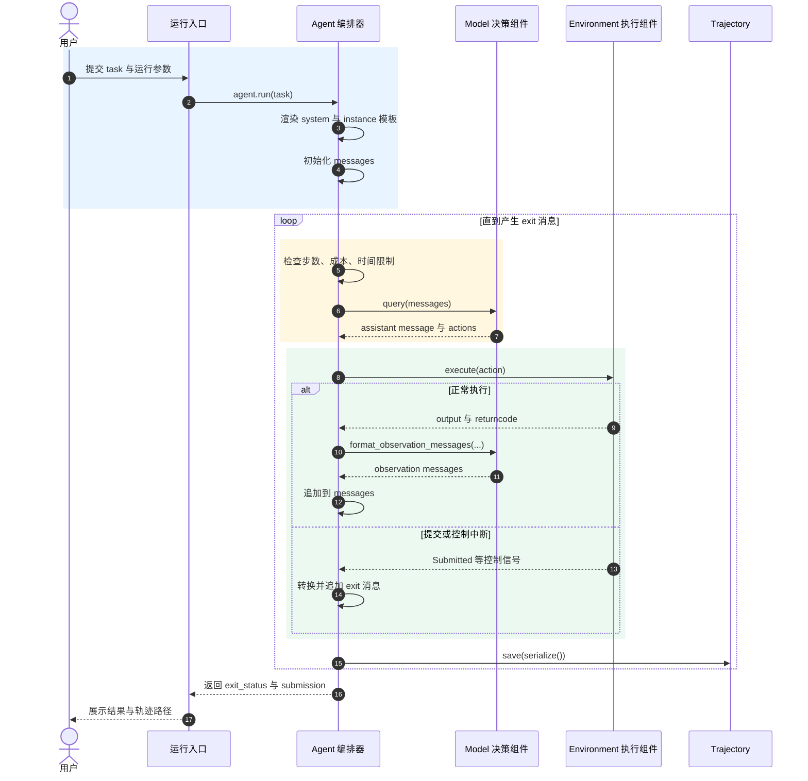

# mini-SWE-agent 核心执行链路

一个以 Bash/终端作为操作接口的软件工程 Agent。

凡是终端能完成、运行环境又允许执行的事情，它原则上都可能完成。

## 阅读目标

这份文档只回答一个问题：**用户交给 mini-SWE-agent 一个任务后，任务如何沿着主链路不断推进，最后结束？**

暂时不展开不同模型、不同环境以及动态装配的实现细节。阅读时先记住一句话：

> Agent 保存运行状态并控制循环，Model 产生下一步动作，Environment 执行动作并返回结果。

完整时序见：`<图：一次任务的核心执行时序>`。

## 从入口进入运行循环

项目提供了两个适合入门观察的入口：

- [`hello_world.py`](../../../src/minisweagent/run/hello_world.py) 显式创建 `LitellmModel`、`LocalEnvironment` 和 `DefaultAgent`，适合第一次理解对象关系。
- [`mini.py`](../../../src/minisweagent/run/mini.py) 先合并配置，再通过工厂动态选择具体实现，适合正式命令行使用。

两个入口在装配方式上不同，但最终都会得到一个具体 Agent 对象，并调用：

```python
agent.run(task)
```

因此，理解运行时主链路时，可以从 [`DefaultAgent.run()`](../../../src/minisweagent/agents/default.py) 开始，而不必先钻进命令行参数和工厂实现。

## 建立第一轮上下文

`DefaultAgent.run(task)` 首先完成三件事：

```python
self.extra_template_vars |= {"task": task, **kwargs}
self.messages = []
self.add_messages(system_message, user_message)
```

这里形成了 Agent 的第一份运行状态：

- `extra_template_vars` 保存本次任务等模板变量。
- `messages` 保存完整对话历史，是 Model 每轮决策的输入。
- `system_message` 来自 `system_template`。
- `user_message` 来自 `instance_template`，其中 `{{ task }}` 会被替换成真实任务。

模板渲染并不只读取 Agent 配置。`get_template_vars()` 会合并：

```text
Agent 配置
Environment 提供的环境信息
Model 提供的模型信息
调用次数、成本、运行时间
任务和额外参数
```

因此，Agent 是模板上下文的汇合点，但各组件仍只提供自己负责的数据。

## 一轮工作如何推进

循环中的最小工作单位是 [`DefaultAgent.step()`](../../../src/minisweagent/agents/default.py)：

```python
def step(self) -> list[dict]:
    return self.execute_actions(self.query())
```

把嵌套调用展开后更加直观：

```python
message = self.query()
observations = self.execute_actions(message)
return observations
```

一轮工作可以分成“决策、执行、反馈”三个阶段。

### 决策

Agent 的 `query()` 先检查步数、成本和运行时间限制，然后调用：

```python
message = self.model.query(self.messages)
```

以 [`LitellmModel`](../../../src/minisweagent/models/litellm_model.py) 为例，Model 会：

- 清理并转换消息格式；
- 调用模型 API；
- 解析模型响应中的工具调用；
- 把工具调用转换为统一的 `actions`；
- 记录响应、成本和时间戳。

返回给 Agent 的消息大体是：

```python
{
    "role": "assistant",
    "content": "...",
    "extra": {
        "actions": [{"command": "pytest"}],
        "cost": 0.01,
    },
}
```

Agent 把这条消息加入 `messages`，并累计调用次数和成本。Model 负责“怎样问、怎样解析”，Agent 负责“何时问、问了多少次、是否还能继续问”。

### 执行

Agent 从模型消息中取出 `actions`，逐个委托给 Environment：

```python
outputs = [
    self.env.execute(action)
    for action in message.get("extra", {}).get("actions", [])
]
```

以 [`LocalEnvironment`](../../../src/minisweagent/environments/local.py) 为例：

```python
{"command": "pytest"}
```

会被交给本地子进程执行，随后得到统一结果：

```python
{
    "output": "...",
    "returncode": 0,
    "exception_info": "",
}
```

Environment 不判断下一步应该做什么；它只执行动作并忠实返回执行结果。

### 反馈

命令输出不能直接、随意地塞回模型上下文。Agent 再次委托 Model：

```python
self.model.format_observation_messages(
    message,
    outputs,
    self.get_template_vars(),
)
```

Model 根据自己的 API 协议和 `observation_template`，把执行结果转换成下一轮可使用的 observation 消息。Agent 将这些消息加入 `messages`，于是下一轮 `model.query(self.messages)` 就能看到刚才发生了什么。

这形成了项目最核心的闭环：

```text
messages → Model 决策 → actions → Environment 执行
    ↑                                  ↓
    └──────── observation ← outputs ───┘
```

## 循环如何结束

`run()` 在每轮结束后检查最后一条消息：

```python
if self.messages[-1].get("role") == "exit":
    break
```

`exit` 消息主要来自以下路径：

- Environment 识别到提交命令，抛出 `Submitted`；
- Agent 达到步数或成本限制，产生 `LimitsExceeded`；
- Agent 达到运行时间限制，产生 `TimeExceeded`；
- 连续格式错误达到上限，产生 `RepeatedFormatError`；
- 未预期异常被记录后继续向外抛出。

这些用于改变主循环走向的异常定义在 [`exceptions.py`](../../../src/minisweagent/exceptions.py)。其中 `Submitted`、`LimitsExceeded` 等继承自 `InterruptAgentFlow`，它们更像“带着消息跳出当前调用层级的控制信号”，不完全等同于程序故障。

无论一轮正常结束还是异常中断，`finally` 都会调用 `save()`。Agent 会把自己的状态与 `model.serialize()`、`env.serialize()` 合并，写成 trajectory。因此 trajectory 是三个运行组件共同状态的快照。

## 先忽略哪些支线

第一次阅读主链路时，可以暂时忽略：

- Typer 如何解析命令行参数；
- YAML 和命令行配置如何递归合并；
- `importlib` 如何动态导入类；
- `InteractiveAgent` 的确认、人工模式和终端输出；
- 不同 Model 的 API 格式差异；
- Docker、Singularity 等环境的启动细节。

它们都不会改变最小闭环：

```python
while not finished:
    message = model.query(messages)
    outputs = [env.execute(action) for action in actions]
    messages.extend(model.format_observation_messages(message, outputs))
```

## 主链路代码地图

| 观察点 | 代码位置 | 核心问题 |
|---|---|---|
| 显式入口 | [`run/hello_world.py`](../../../src/minisweagent/run/hello_world.py) | 三个对象如何直接创建？ |
| 动态入口 | [`run/mini.py`](../../../src/minisweagent/run/mini.py) | 配置如何变成运行对象？ |
| 主循环 | [`agents/default.py`](../../../src/minisweagent/agents/default.py) | 任务如何循环推进？ |
| 模型调用 | [`models/litellm_model.py`](../../../src/minisweagent/models/litellm_model.py) | 消息如何变成动作？ |
| 本地执行 | [`environments/local.py`](../../../src/minisweagent/environments/local.py) | 动作如何变成命令结果？ |
| 控制信号 | [`exceptions.py`](../../../src/minisweagent/exceptions.py) | 循环为什么结束？ |

## 附录：一次任务的核心执行时序


