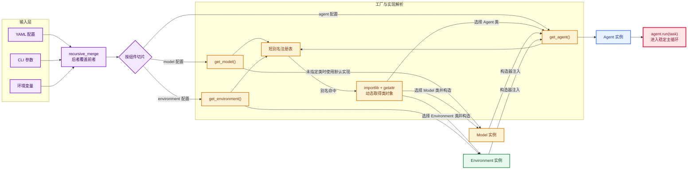

# mini-SWE-agent 的可扩展工程化落地

## 工程化目标

业务架构确定了三个角色后，工程落地需要继续解决：

- 入口怎样只依赖抽象角色，而不是写死全部实现？
- 用户怎样通过配置更换 Agent、Model 或 Environment？
- 新实现怎样接入，同时不修改核心循环？
- 显式、易读的入门方式和灵活、动态的正式入口怎样共存？

项目采用的答案可以概括为：

> 根包 Protocol 定义契约，子包放置实现，子包 `__init__.py` 提供工厂与别名注册表，运行入口完成构造器注入，配置决定具体实现。

完整装配过程见：`<图：从配置到运行对象图>`。

## 分层落地

项目目录可以按职责理解，而不只是按文件类型记忆：

```text
minisweagent/
├── __init__.py              核心角色的 Protocol 与公共包信息
├── agents/                  控制循环的具体实现与 Agent 工厂
├── models/                  决策策略的具体实现与 Model 工厂
├── environments/            执行策略的具体实现与 Environment 工厂
├── config/                  内置配置与配置读取
├── run/                     应用入口和对象装配
├── utils/                   跨组件的通用小工具
└── exceptions.py            跨调用层级的控制信号
```

这里有三个不同层级，不能混为一谈：

| 层级 | 回答的问题 | 代表代码 |
|---|---|---|
| 契约层 | 一个角色最少应该会什么？ | 根包中的 `Protocol` |
| 实现层 | 这些能力具体怎样完成？ | `DefaultAgent`、`LitellmModel`、`LocalEnvironment` |
| 装配层 | 本次运行选择哪些实现？ | `get_agent()`、`get_model()`、`get_environment()`、`run/mini.py` |

## 两种入口保留两种价值

[`hello_world.py`](../../../src/minisweagent/run/hello_world.py) 采用显式装配：

```python
agent = DefaultAgent(
    LitellmModel(model_name=model_name),
    LocalEnvironment(),
    **agent_config,
)
```

它的优势是对象图一眼可见，适合作为文档、测试和定制脚本的起点。

[`mini.py`](../../../src/minisweagent/run/mini.py) 采用动态装配：

```python
model = get_model(config=config.get("model", {}))
env = get_environment(config.get("environment", {}), default_type="local")
agent = get_agent(model, env, config.get("agent", {}), default_type="interactive")
```

它的优势是同一个 CLI 可以根据 YAML 或命令行参数选择不同实现。

两者不是两套架构：它们只是在“谁决定具体类”这件事上不同。显式入口由代码作者决定，动态入口由配置决定。

## 配置先合并，再按组件切片

`mini.py` 的配置来源包括：

- 内置或用户指定的 YAML；
- `-c key=value` 形式的覆盖项；
- `--model-class`、`--agent-class`、`--environment-class` 等命令行选项；
- 模型名等环境变量兜底。

[`recursive_merge()`](../../../src/minisweagent/utils/serialize.py) 按顺序递归合并字典，后面的配置覆盖前面的配置，并跳过 `UNSET`。合并后形成：

```python
{
    "run": {...},
    "agent": {...},
    "model": {...},
    "environment": {...},
}
```

入口随后按组件切片：

```python
config.get("model", {})
config.get("environment", {})
config.get("agent", {})
```

这种结构让每个工厂只认识自己的配置，不必接收一份包含所有业务参数的巨大对象。

## 工厂如何把字符串变成对象

以 [`get_agent()`](../../../src/minisweagent/agents/__init__.py) 为例：

```python
_AGENT_MAPPING = {
    "default": "minisweagent.agents.default.DefaultAgent",
    "interactive": "minisweagent.agents.interactive.InteractiveAgent",
}

def get_agent(model, env, config, *, default_type=""):
    config = copy.deepcopy(config)
    agent_class = get_agent_class(
        config.pop("agent_class", default_type)
    )
    return agent_class(model, env, **config)
```

这里组合了几个工程手法：

### 别名注册表

用户写：

```yaml
agent:
  agent_class: interactive
```

注册表把短别名转换为完整导入路径：

```text
interactive
    ↓
minisweagent.agents.interactive.InteractiveAgent
```

短别名提供稳定、友好的配置界面，避免用户到处复制很长的 Python 路径。

### 动态导入

工厂用 `importlib.import_module()` 和 `getattr()` 取得真正的类对象：

```python
module_name, class_name = full_path.rsplit(".", 1)
module = importlib.import_module(module_name)
agent_class = getattr(module, class_name)
```

此时 `agent_class` 是一个类，而不是字符串，所以：

```python
agent_class(model, env, **config)
```

就是动态版本的：

```python
InteractiveAgent(model, env, **config)
```

### 默认实现

`default_type="interactive"` 表示：配置中没有 `agent_class` 时，使用 `interactive`。它不是 Agent 的运行模式或新能力，只是工厂选择实现时的兜底别名。

### 构造器注入

工厂选择出类后，把已经创建好的 Model 和 Environment 传给 Agent：

```python
return agent_class(model, env, **config)
```

这就是轻量的依赖注入。Agent 不在内部写死：

```python
self.model = LitellmModel(...)
self.env = LocalEnvironment(...)
```

所以入口可以自由组合实现，Agent 核心循环也更容易测试和复用。

## 使用了哪些通用设计思想

这些思想并不专属于 Python：

| 设计思想 | 项目中的落点 | 解决的问题 |
|---|---|---|
| Strategy | 多种 Model、Environment 实现 | 决策和执行策略可以替换 |
| Factory | `get_agent()`、`get_model()`、`get_environment()` | 隐藏动态选择和构造细节 |
| Registry | `_AGENT_MAPPING` 等映射表 | 用稳定短名称找到实现 |
| Dependency Injection | Agent 构造器接收 model、env | 控制器不写死具体依赖 |
| Ports and Adapters | Protocol 是端口，具体实现是适配器 | 核心流程隔离外部 API 和执行环境 |
| Template Method | `InteractiveAgent` 覆盖基础步骤 | 保留主循环并扩展局部行为 |
| Configuration Object | Pydantic Config 类 | 集中默认值、字段和验证 |
| Serialization Boundary | 三个组件各自 `serialize()` | 运行状态可组合、可追踪 |

这些模式不是为了追求名词数量，而是共同服务于一个结果：**稳定的主链路依赖抽象角色，变化被压缩到实现和装配层。**

## 为什么说“轻量插件式”

三个工厂都支持两类 `spec`：

- 注册表中的短别名，例如 `interactive`、`litellm`、`local`；
- 完整类路径，例如 `my_package.my_agent.MyAgent`。

因此，一个外部实现只要：

- 能被当前 Python 环境导入；
- 方法满足对应 Protocol；
- 构造函数能接收工厂传入的配置；

就可以通过完整类路径接入，而不必先修改核心主循环。若希望使用短别名，则需要再修改对应 `_MAPPING`。

这已经具备插件式扩展的核心体验，但它不是一个完整插件平台，因为当前代码没有提供：

- 自动扫描与发现；
- 插件生命周期管理；
- 版本兼容协商；
- 独立权限或进程隔离；
- 安装、卸载和依赖解析协议。

因此更准确的称呼是：**基于动态导入和结构化接口的轻量可插拔架构。**

## 接入一个新实现的最短路径

以新增 Environment 为例，通用步骤是：

### 保持角色契约

实现：

```python
class RemoteEnvironment:
    def execute(self, action: dict, cwd: str = "") -> dict:
        ...

    def get_template_vars(self, **kwargs) -> dict:
        ...

    def serialize(self) -> dict:
        ...
```

不要求显式继承 `Environment`，但方法签名和语义必须兼容。

### 保持数据语义

`execute()` 返回值至少要能被当前 Model 的 observation 格式化逻辑理解，例如包含：

```python
{
    "output": "...",
    "returncode": 0,
    "exception_info": "",
}
```

只有方法名相同还不够，跨组件数据的含义也必须一致。

### 选择接入方式

无需改注册表时，配置完整路径：

```yaml
environment:
  environment_class: my_package.remote.RemoteEnvironment
  endpoint: https://example.invalid
```

需要友好短名时，再把路径加入 `_ENVIRONMENT_MAPPING`：

```python
"remote": "my_package.remote.RemoteEnvironment"
```

Agent 和 Model 的扩展过程相同：先满足 Protocol 和构造约定，再通过完整路径或注册别名选择实现。

## 灵活性带来的约束

动态装配降低了入口对具体类的耦合，也把一部分问题推迟到了运行时：

- 完整路径拼错时，只有动态导入时才会报错；
- Protocol 默认不会强制做运行时接口校验；
- `**config` 的字段必须与具体实现的配置类匹配；
- 不同实现必须遵守 actions、outputs、messages 的语义约定；
- 三套工厂当前存在相似的动态导入代码，扩展时要保持行为一致。

所以可插拔并不等于“任意类都能放进来”。真正的扩展契约由三部分共同组成：

```text
Protocol 方法形状
构造函数与配置约定
跨组件数据语义
```

读懂这三层，比只看 `_MAPPING` 注册表更接近项目真正的工程边界。

## 工程阅读地图

| 想理解的工程问题 | 入口文件 |
|---|---|
| 三个角色的最小接口 | [`minisweagent/__init__.py`](../../../src/minisweagent/__init__.py) |
| Agent 的选择与构造 | [`agents/__init__.py`](../../../src/minisweagent/agents/__init__.py) |
| Model 的选择与模型名解析 | [`models/__init__.py`](../../../src/minisweagent/models/__init__.py) |
| Environment 的选择与构造 | [`environments/__init__.py`](../../../src/minisweagent/environments/__init__.py) |
| 配置文件和键值配置解析 | [`config/__init__.py`](../../../src/minisweagent/config/__init__.py) |
| 配置覆盖优先级 | [`utils/serialize.py`](../../../src/minisweagent/utils/serialize.py) |
| 显式装配 | [`run/hello_world.py`](../../../src/minisweagent/run/hello_world.py) |
| 动态装配 | [`run/mini.py`](../../../src/minisweagent/run/mini.py) |

## 附录：从配置到运行对象图


