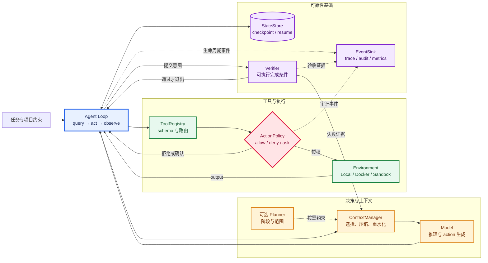
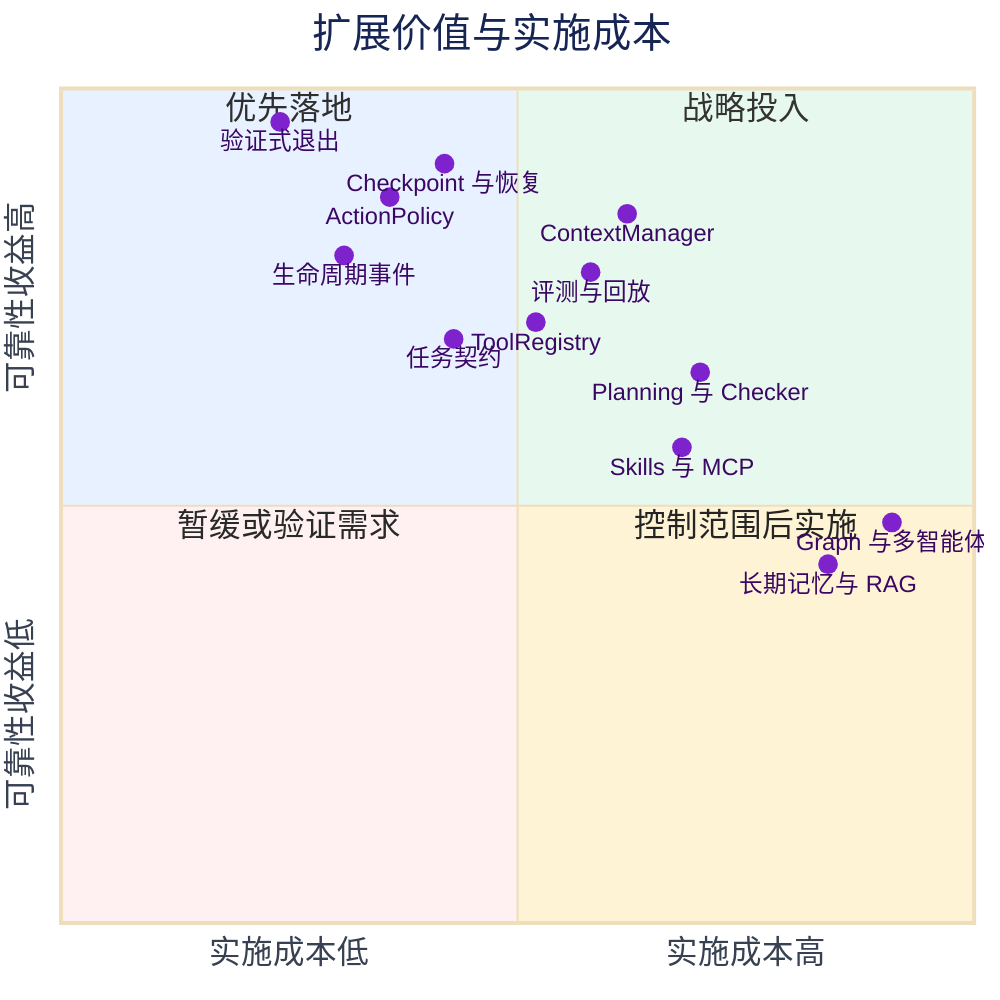
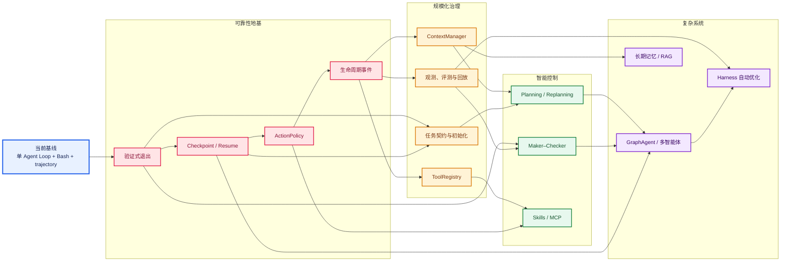

# mini-SWE-agent Harness 扩展评估与演进路线

## 核心结论

当前 mini-SWE-agent 已经具备一个清晰、可替换、可运行的最小 Agent Loop：Agent 负责循环和状态，Model 负责决策及模型协议适配，Environment 负责执行，配置和工厂负责动态装配。它最有价值的特征是代码少、主链路短、对象边界清楚。

但“最小可运行”还不等于“长时间可靠运行”。当前系统更接近一个优秀的 Agent 内核，而不是完整的工程 Harness。它已经能让模型持续调用 Bash 完成任务，却仍主要依赖提示词和模型自觉来规划、验证、控制范围和宣布完成。

结合当前代码与两份外部资料，建议的扩展原则是：

- 先把“完成”变成可执行证据，再增加更多智能模式；
- 先让任务能够安全恢复，再追求更长的单次上下文；
- 先建立工具权限和审计边界，再接入更多工具；
- 先用轻量事件扩展点承载横切能力，再考虑完整插件平台；
- 多智能体、图编排和长期记忆应由真实任务复杂度触发，不应成为默认内核。

因此，最高优先级不是增加 RAG、MCP 或多个 Agent，而是补齐验证退出、状态恢复、工具治理和最小事件观测。这些能力会直接提升现有单 Agent Loop 的成功率，也为后续扩展建立可信基础。

`<图：从最小 Agent Loop 到可靠 Harness 的能力分层>`

## 当前能力与 Harness 缺口

现有三份架构文档已经说明了主体关系、执行闭环和动态装配。本节只在这些结论上继续追问：一个长时间运行、能够交付真实代码变更的 Harness 还缺什么？

| 维度 | 当前已有能力 | 代码所反映的边界 | 主要风险 |
|---|---|---|---|
| 核心循环 | `DefaultAgent.run()` 持续执行 `query → action → observation` | 单循环结构清楚，异常可转成控制信号 | 长任务仍主要依赖模型临场反应，没有显式阶段状态 |
| 模型接入 | 多种 Model 实现、统一消息和 observation 适配 | 工厂可动态选择模型；工具调用模型中固定暴露 Bash | 模型替换灵活，但工具集合和模型适配仍绑定较深 |
| 执行环境 | Local、Docker、Singularity、Bubblewrap 等多种环境 | `Environment.execute(action)` 是稳定执行边界 | Local 模式直接使用 `shell=True`，缺少统一权限策略和作用域约束 |
| 人工控制 | `confirm / human / yolo` 模式、正则白名单、退出确认 | 控制集中在 `InteractiveAgent` 的方法覆盖中 | “是否询问”不等于“是否安全”；非交互运行缺少策略化授权 |
| 运行限制 | 步数、成本、墙钟时间、连续格式错误限制 | 限制由 Agent 在查询前检查 | 只限制资源消耗，不能判断工作质量和完成条件 |
| 状态记录 | 每轮保存完整 trajectory，包含消息、成本、配置和原始输出 | `save()` 覆盖写入当前快照，Inspector 可供人工查看 | 没有 `load/resume`、追加式事件、恢复点和外部世界对账 |
| 上下文 | 完整 `messages` 每轮交给 Model，超长命令输出在模板中截断 | 没有 token 预算、重要性选择、压缩、重水化 | 长任务会被重复日志和过期信息污染，成本和注意力持续增长 |
| 完成机制 | Environment 识别提交哨兵命令并产生 `Submitted` | 首行是约定文本且命令返回码为 0 即可退出 | “模型声称完成”仍可能绕过测试、启动检查和端到端验收 |
| 可观测性 | trajectory、时间戳、成本、调用次数、异常和批任务进度 | 已有事后检查数据，但缺少统一事件语义 | 难以稳定回答失败发生在哪一阶段、为何重试、哪些证据支持完成 |
| 评测 | 有单元测试、SWE-bench 等 benchmark runner | 可以评估特定基准，但不是通用 Harness 回归框架 | 很难比较一次 Harness 改动究竟提升成功率还是只增加 token |
| 编排 | 单 Agent 可替换，Benchmark 可并行运行独立实例 | 没有协作 Agent 的共享状态、委派、汇合和冲突处理 | 直接增加多个 Agent 会产生重复工作、责任不清和状态竞争 |

几个关键判断需要说得更明确。

**Trajectory 不等于可恢复状态。** 当前 trajectory 是很有价值的运行快照，但恢复不仅要重新获得消息，还要知道工作区是否变化、上一个 action 是否已经产生副作用、哪些权限仍然有效、验证执行到了哪一层。当前 `Agent Protocol` 只有 `run()` 和 `save()`，没有恢复语义。

**退出哨兵不等于完成验证。** [`LocalEnvironment._check_finished()`](../../../src/minisweagent/environments/local.py) 只检查提交文本和 shell 返回码。模型可以先输出提交命令，而 Harness 不会自动要求 lint、单元测试、集成测试或任务特定验收全部通过。

**交互确认不等于权限系统。** [`InteractiveAgent`](../../../src/minisweagent/agents/interactive.py) 可以询问用户是否执行命令，但授权判断与终端交互耦合。它没有描述“只能读哪些目录、能否联网、哪些命令必须拒绝、哪些写操作需要二次批准、审批有效期多久”。

**Bash 很通用，但不是完整工具协议。** [`BASH_TOOL`](../../../src/minisweagent/models/utils/actions_toolcall.py) 能让最小 Agent 获得很强的通用能力，不过当前解析逻辑只接受名为 `bash` 的工具。继续添加搜索、浏览器、代码索引、MCP 或领域 API 时，如果直接复制 Model 解析代码，扩展成本和权限风险都会快速增长。

## 外部观点如何映射到当前项目

[知乎文章《深入浅出完整解析 AI Agent 的核心基础知识》](https://zhuanlan.zhihu.com/p/1919046969076195976) 把 Agent 描述为从 Answer Machine 走向 Work Machine 的运行系统，并将上下文工程、工具调用、规划、记忆、反馈、权限、可观测性和多智能体协作视为支撑能力。对当前项目最有价值的不是照单全收这些名词，而是其中几条工程判断：

- Agent Loop 是主轴，其他模块必须围绕循环提供信息、约束、执行或反馈，不能成为互相割裂的功能堆积；
- 上下文工程不是把更多内容塞给模型，而是在每轮调用前重建“最小高信号工作台”；
- 文件、计划、权限、工具结果和失败记录等关键状态应外部化，并在需要时重水化；
- 工具数量不是目标，工具协议、权限边界和结果校验更重要；
- Reflection 只有与测试、规则或独立评审器结合才可靠，否则容易成为模型自说自话；
- 低层循环、中层规划、高层审批与工作流、外层多智能体属于逐层增加的控制能力，不应一次全部塞入核心循环。

[Learn Harness Engineering](https://github.com/walkinglabs/learn-harness-engineering) 将 Harness 概括为 instructions、state、verification、scope 和 session lifecycle 五个子系统。这个框架对 mini-SWE-agent 的补充尤其直接：

- [仓库作为事实来源](https://github.com/walkinglabs/learn-harness-engineering/blob/main/docs/en/lectures/lecture-03-why-the-repository-must-become-the-system-of-record/index.md)：项目知识应靠近代码、最小但完整，并能让全新会话回答“是什么、怎么运行、怎么验证、进度在哪”；
- [跨会话连续性](https://github.com/walkinglabs/learn-harness-engineering/blob/main/docs/en/lectures/lecture-05-why-long-running-tasks-lose-continuity/index.md)：进度、决策原因、验证状态和代码检查点需要持久化，减少新会话的重建成本与理解漂移；
- [阻止过早宣布完成](https://github.com/walkinglabs/learn-harness-engineering/blob/main/docs/en/lectures/lecture-09-why-agents-declare-victory-too-early/index.md)：完成条件应是 Harness 可执行的终止谓词，而不是模型的主观信心；
- [可观测性属于 Harness](https://github.com/walkinglabs/learn-harness-engineering/blob/main/docs/en/lectures/lecture-11-why-observability-belongs-inside-the-harness/index.md)：日志、trace、健康检查、验收清单和评分标准要成为下一轮决策的证据；
- [从 Loop 到 Graph](https://github.com/walkinglabs/learn-harness-engineering/blob/main/docs/en/lectures/lecture-14-graph-engineering/index.md)：只有当任务确实需要专业化、并行、共享状态、验证和恢复时，单循环才应演进为图。

这些观点与项目的最小主义并不冲突。它们提示的不是“把所有流行模块都加进来”，而是把可靠性机制放在模型之外，并保持为可替换的小组件。

## 建议扩展的能力边界

扩展时不宜只继续增加 `Agent` 子类。Agent 子类适合改变控制流程，Model 子类适合改变模型协议，Environment 子类适合改变执行位置；验证、状态、上下文、策略和观测是横切能力，更适合通过组合注入。

| 扩展能力 | 建议职责 | 推荐接入点 | 不应该负责 |
|---|---|---|---|
| `Verifier` | 执行完成条件，返回结构化证据和失败原因 | Agent 收到提交意图之后、生成 `exit` 之前 | 不替 Model 写代码，不从自然语言猜测通过与否 |
| `StateStore` | 保存 checkpoint、计划、决策、验证结果、action 状态；支持恢复 | 每轮 action 前后、异常退出和正常交接时 | 不把整个工作区无差别复制成“记忆” |
| `ContextManager` | 选择、裁剪、压缩和重水化下一轮消息 | `model.query()` 之前 | 不改变真实任务状态，不隐藏关键失败证据 |
| `ToolRegistry` | 注册工具 schema、解析统一 action、路由执行器 | Model 与执行边界之间 | 不默认授权所有已安装工具 |
| `ActionPolicy` | allow、deny、ask、scope、budget、审批有效期和审计原因 | action 执行之前 | 不与终端输入实现绑定，不依赖模型自我约束 |
| `EventSink` / Hooks | 接收运行生命周期事件，供日志、指标、审计和扩展使用 | run、query、action、verify、checkpoint、exit 等边界 | 不修改核心状态，除非事件类型明确允许拦截 |
| `TaskContract` | 声明范围、禁止项、交付物和可执行验收标准 | 任务开始时构建，规划和验证共同读取 | 不成为另一个无限增长的大 Prompt |
| `Evaluator` | 离线回放 trajectory，按任务结果、成本、步骤和安全事件评分 | 运行完成之后或 benchmark 流程 | 不直接影响一次生产任务的真实状态 |

最小接口可以保持项目现有的 Protocol 风格。例如概念上只需要：

```python
class Verifier(Protocol):
    def verify(self, task: str, state: dict) -> dict: ...

class StateStore(Protocol):
    def checkpoint(self, state: dict) -> None: ...
    def load(self) -> dict | None: ...

class ActionPolicy(Protocol):
    def authorize(self, action: dict, state: dict) -> dict: ...

class EventSink(Protocol):
    def emit(self, event: dict) -> None: ...
```

这些接口不一定马上进入根包，也不需要一开始就建设自动发现、安装卸载和版本协商。先提供默认的 no-op 实现和构造器注入，就能保持 `hello_world.py` 的显式可读性，同时让 `mini.py` 继续通过配置选择实现。

扩展后的单轮流程可以保持非常短：

```text
恢复或初始化状态
    → ContextManager 组装本轮上下文
    → Model 产生 action
    → ActionPolicy 授权
    → Tool/Environment 执行
    → 记录事件与 checkpoint
    → 收到提交意图时由 Verifier 验证
    → 通过才退出，失败则把证据反馈给下一轮
```

这仍然是原来的 Agent Loop，只是把原先依赖 Prompt 的隐式要求变成了 Harness 可执行的机制。

## 扩展方向与落地价值

| 方向 | 可以新增的功能 | 对当前不足的改善 | 代码落点建议 |
|---|---|---|---|
| 验证式退出 | 配置验证命令、分层验证、任务特定验收、证据清单、失败后继续循环 | 消除提交哨兵导致的过早完成 | 在 `Submitted` 转成最终 `exit` 之前增加 Verifier；不要放进 Model |
| 会话生命周期 | preflight、checkpoint、resume、handoff、cleanup、外部状态对账 | 支持崩溃恢复和跨会话连续工作 | 扩展 Agent 的启动/结束边界，状态存储使用独立组件 |
| 上下文调度 | token 预算、最近窗口、失败保留、摘要、文件引用、按需重水化 | 降低长任务成本、context rot 和注意力稀释 | 在 `DefaultAgent.query()` 调用 Model 之前注入 ContextManager |
| 工具体系 | 通用 Tool schema、工具注册、结构化参数、MCP 适配、结果验证 | 从单一 Bash 扩展到可治理工具集合 | 把 Bash 从硬编码常量演进为默认 Tool；保持 action 为统一数据协议 |
| 安全策略 | 命令分级、目录 scope、网络权限、敏感信息遮蔽、审批票据、审计日志 | 让 yolo 和非交互运行也具备明确边界 | ActionPolicy 在 Environment 之前执行；隔离环境继续作为纵深防御 |
| 结构化观测 | 生命周期事件、action duration、重试原因、验证证据、状态变化、trace id | 从“能看 trajectory”升级为“能定位失败并比较改动” | Agent 发出稳定事件，日志和指标作为 EventSink 实现 |
| 评测回放 | deterministic replay、任务集、成功率、成本、步数、违规率、消融对比 | 量化 Harness 改动的真实收益 | 复用 trajectory 和 benchmark runner，增加统一评分报告 |
| 显式规划 | 计划状态、阶段检查、重新规划、范围锁定、Definition of Done | 降低复杂任务中的漂移和遗漏 | 先作为 Agent 组合组件或新 Agent 实现，不修改 Model 接口语义 |
| Maker–Checker | 生成器与独立验证器分离，失败证据返回生成循环 | 让 Reflection 建立在客观证据上 | 优先用确定性 Verifier，必要时再引入第二 Model |
| Skills 与渐进披露 | 根据任务加载局部说明、标准流程、模板和工具说明 | 避免巨型 system prompt，降低发现成本 | Skills 先作为只读上下文源，再考虑可执行脚本和安装协议 |
| 多智能体与图 | 委派、并行分支、fan-in、共享状态、冲突检测、回滚边 | 支撑真正需要专业化和并行的任务 | 新建独立 GraphAgent/runner，避免把 `DefaultAgent.run()` 变成通用工作流引擎 |
| 长期记忆与 RAG | 决策索引、历史故障模式、按需检索、引用来源 | 跨任务复用高价值经验 | 必须晚于状态模型和评测，且只保存可追溯信息 |

其中有三点值得避免误区。

**上下文管理优先于长期记忆。** 当前最直接的问题是每轮都发送不断增长的 `messages`。在没有选择、压缩、引用和恢复规则之前增加向量库，只会增加更多可能进入上下文的信息。

**确定性验证优先于 Reflection Agent。** 能通过 pytest、lint、type check、启动检查和端到端脚本判断的问题，不应先调用另一个模型“感觉一下”。模型评审适合处理体验、可读性和开放性标准，但也需要 rubric 和证据。

**工具治理优先于工具数量。** MCP、浏览器和外部 API 会显著扩大系统能力，同时扩大副作用、凭据和提示注入风险。只有 Tool schema、ActionPolicy、审计与结果校验建立之后，工具生态才适合快速扩张。

## 优先级与演进路线

优先级综合考虑五个因素：是否直接减少错误完成、是否是其他能力的依赖、是否能保持最小实现、是否容易用测试验证、是否会扩大安全和维护成本。图中的价值与成本是针对当前代码基线的相对判断，不是精确工期估算。

`<图：扩展价值与实施成本优先级矩阵>`

| 优先级 | 能力 | 为什么现在做 | 最小可交付版本 | 验收信号 |
|---|---|---|---|---|
| P0 | 验证式退出 | 当前提交由模型触发，缺乏客观完成门槛 | 配置 `verification_commands`；提交时依次执行；全部通过才产生 `Submitted` | 人为让测试失败时 Agent 不能成功退出，失败证据进入下一轮 |
| P0 | Checkpoint、resume 与 lifecycle | 已有 trajectory 基础，但中断后不能恢复执行语义 | 保存版本化 checkpoint；CLI 支持 `--resume`；恢复时核对 cwd、git 状态和最后 action | 进程中断后能恢复，且不会重复已完成的有副作用 action |
| P0 | 最小 ActionPolicy 与审计 | LocalEnvironment 能执行任意 shell，确认模式不能覆盖无人值守场景 | `allow/deny/ask`、cwd scope、原因记录；默认策略保持兼容 | 禁止动作在进入 Environment 前被拒绝，trajectory 能解释原因 |
| P0 | 生命周期事件扩展点 | 验证、策略、观测继续靠子类覆盖会迅速膨胀 | 固定少量事件：run/query/action/verify/checkpoint/exit；默认 no-op | 不修改主循环即可采集完整一次运行的结构化事件 |
| P1 | ContextManager | 长任务消息只增不减，输出截断不等于上下文治理 | token 预算、保留最近轮次与关键失败、摘要和外部引用 | 固定任务成功率不降，同时 token、成本或上下文长度下降 |
| P1 | ToolRegistry 与统一 Action | Bash 硬编码阻碍安全地增加工具 | Bash 作为第一个注册工具；统一 `name/arguments/id` action | 新增一个只读工具无需修改各 Model 的核心解析分支 |
| P1 | 结构化观测、评测与回放 | 无法量化 Harness 改动效果 | 基于事件和 trajectory 输出成功率、成本、步骤、验证失败、策略拒绝 | 同一任务集可比较修改前后，报告可复现 |
| P1 | 任务契约与仓库初始化 | Prompt 中有流程建议，但范围和验收标准未结构化 | 启动时读取项目说明、运行/验证命令、范围与交付物；执行 preflight | 新会话能回答项目、运行、验证、进度和当前任务边界 |
| P2 | 显式 Planning 和 Maker–Checker | 基础可靠性建立后，复杂任务需要分阶段控制 | 计划持久化、阶段状态、失败重规划；Checker 优先复用 Verifier | 多文件长任务的遗漏率和重复探索下降 |
| P2 | Skills、MCP 和领域工具 | 工具协议与权限准备好后可扩大任务覆盖 | 渐进加载说明；只读 MCP 先行；每个工具声明权限和输出 schema | 工具发现不显著增加基础上下文，违规调用可审计 |
| P3 | GraphAgent 与多智能体 | 只对专业化、并行和独立审查确有收益 | planner、worker、checker 三节点；隔离工作区；显式 fan-in | 相比单 Agent 在目标任务集上有可测收益，且冲突与成本受控 |
| P3 | 长期记忆、RAG、自动 Harness 优化 | 容易引入陈旧知识、错误归因和评测污染 | 仅索引可追溯决策与失败证据；离线评测后再启用 | 召回内容有来源、可删除、能证明提升而非增加噪声 |

推荐演进顺序见：`<图：分阶段演进路线>`。

第一阶段结束时，Agent 即使仍只有 Bash 和单循环，也应具备这样的可靠性：不能绕过验证退出；中断后可以恢复；危险动作有策略边界；关键运行事件可追踪。

第二阶段才解决规模问题：上下文变长、工具变多、Harness 修改需要量化。此时 ContextManager、ToolRegistry 和统一评测会比新增 Agent 角色更有收益。

第三阶段开始加入“更聪明的控制”：任务契约、显式计划、重新规划和 Maker–Checker。它们建立在前两阶段的状态、事件和验证证据之上，避免把规划降级成一段容易过期的自然语言列表。

第四阶段只面向被真实数据证明的复杂任务。若单 Agent 在可接受成本内已经稳定完成，就没有必要支付图编排、并发隔离、共享状态和共识管理的复杂度税。

## 设计边界与取舍

项目的目标是“最简单、最小、最可读的 Agent”，扩展路线必须保护这个目标。

- `DefaultAgent` 继续保持参考实现，只增加少数稳定调用点；高级行为优先放在独立实现或可选组件中。
- `hello_world.py` 继续显式构造对象，让学习者一眼看到 Model、Environment、Verifier、StateStore 等依赖；`mini.py` 再承担动态配置装配。
- 新组件使用 Protocol 和简单字典/dataclass 作为边界，不先引入重量级 DI、工作流或插件框架。
- 事件 Hooks 应有固定名称和数据 schema，避免允许任意 Hook 隐式修改所有内部状态。
- checkpoint 必须版本化，并区分 conversation、control、verification 和 external-world state，不能只序列化 `messages`。
- ActionPolicy 与隔离环境是互补关系：策略减少不应发生的动作，容器或沙箱限制动作发生后的影响。
- 验证命令必须由项目或任务契约提供，不能让模型在准备退出时自行改写验收标准。
- 所有高级扩展都应通过固定任务集比较成功率、错误完成率、成本、步骤数和人工介入次数；没有测量就不进入默认路径。

最终应该形成两条清楚的产品线，而不是一个越来越重的类：

```text
教学与最小内核：DefaultAgent + Model + Environment
可靠工程运行：在同一 Loop 周围按需组合 State、Context、Policy、Verifier、Events
```

这样既保留项目最值得学习的主链路，也允许它逐步成长为更可靠的 Harness。

## 参考资料

- [现有理解：核心主体与协作边界](../agent-architecture/core-components-and-collaboration.md)
- [现有理解：核心执行链路](../agent-architecture/core-execution-flow.md)
- [现有理解：可扩展工程化落地](../agent-architecture/extensible-engineering-design.md)
- [知乎：深入浅出完整解析 AI Agent 的核心基础知识](https://zhuanlan.zhihu.com/p/1919046969076195976)
- [GitHub：Learn Harness Engineering](https://github.com/walkinglabs/learn-harness-engineering)
- [Mermaid：Flowchart 官方语法](https://mermaid.js.org/syntax/flowchart)
- [Mermaid：Quadrant Chart 官方语法](https://mermaid.js.org/syntax/quadrantChart)

## 附录：Mermaid 源码

### 从最小 Agent Loop 到可靠 Harness 的能力分层



### 扩展价值与实施成本优先级矩阵

矩阵位置是基于当前代码结构的相对估计：横轴越右实施成本越高，纵轴越上可靠性收益越高。



### 分阶段演进路线


